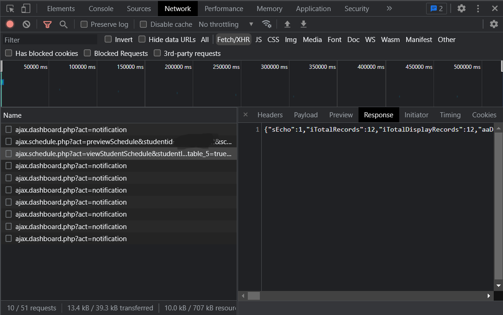

# Scheduler

Convert `Jadwal Mahasiswa`'s data from igracias telkom university to Google Calendar.

## Usage
1. Login with your account into Igracias, goto Registration > Schedule > Student Schedule.
2. Inspect element or press `ctrl + shift + i`, goto tap Network and press `ctrl + r` for reload.
3. Click `Fetch/XHR` and search for `ajax.schedule.php?act=viewStudentSchedule&studentId=...` and click to tap `Response`.
4. You will see some data like this (see `example/example.json`), 
5. Just copy all response data and save into `data.json`
6. Run `scheduler.py`.
    ```sh
    # install all required modules
    $ python3 -m pip install -r requirements.txt

    # just run
    $ python3 scheduler.py
    ```
7. You'll see `schedule.ics` file.
8. Import `schedule.ics` to your google calendar.
